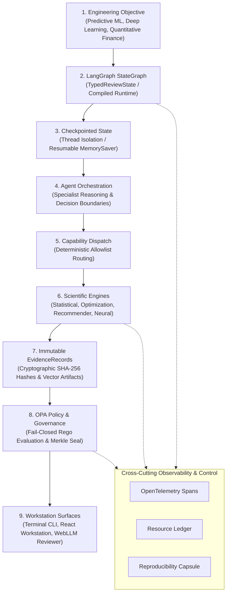
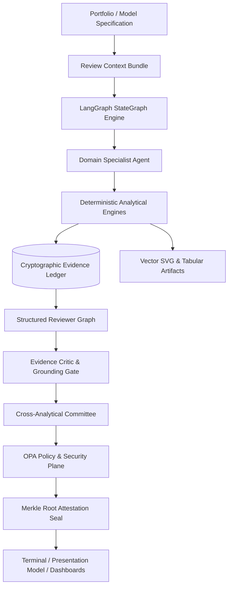
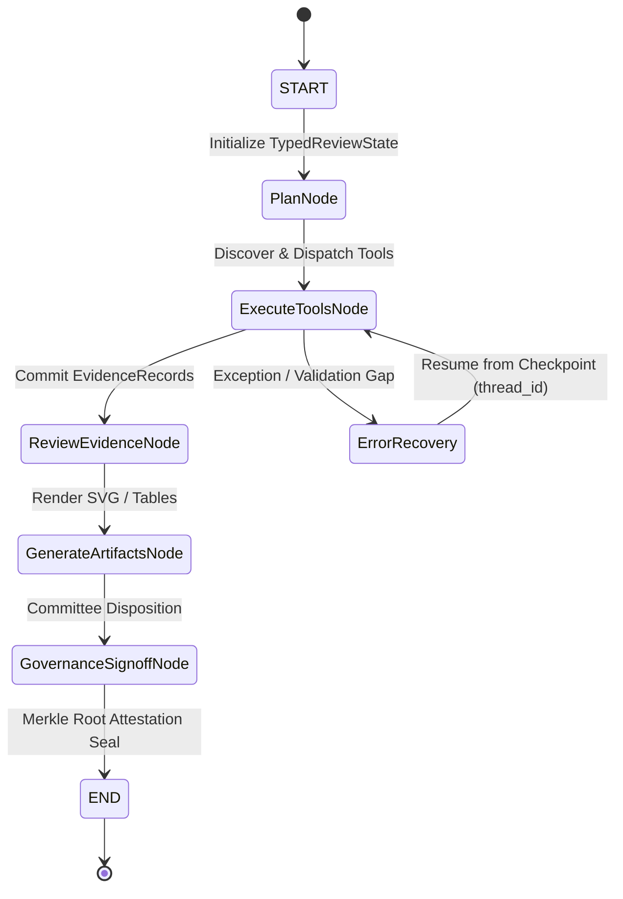
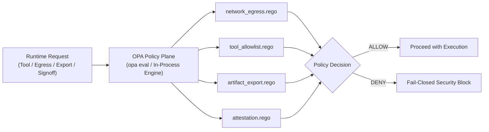
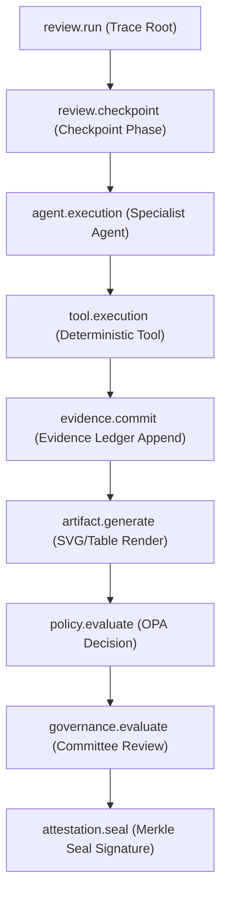
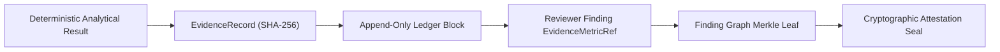

# StART — Standardized Agentic Reusable Tests

**Release: v6.0.1** | **Python: >= 3.12.13** | **License: Apache-2.0**

StART is an **evidence-native model dev/review, risk management, and governance platform** designed for institutional machine learning, deep learning, and quantitative finance.

Unlike conventional LLM-based assistants that perform hallucination-prone arithmetic, StART enforces a strict architectural invariant: **AI agents reason and orchestrate, while deterministic mathematical engines perform all computations**. Every diagnostic produces an immutable, cryptographically signed `EvidenceRecord`, which is appended to a replayable hash-chained ledger and sealed into a Merkle tree attestation.

---

## Architectural Invariant & Orchestration



> **Core System Tenet**:
> * **LangGraph** orchestrates.
> * **Agents** reason.
> * **Deterministic engines** calculate.
> * **EvidenceRecords** prove.
> * **OPA** governs.
> * **OpenTelemetry** observes.

---

## Quick Start

### 1. Installation & Environment Setup

```bash
# Clone repository
git clone https://github.com/supratik-sarkar/StART.git
cd StART

# Create and activate Python virtual environment (Python >= 3.12.13 required)
python3.12 -m venv .venv-start
source .venv-start/bin/activate

# Install package with core and developer dependencies
pip install -e ".[all]"

# Verify environment integrity
start doctor
```

### 2. Run Deterministic Workflows

```bash
# Run Predictive & Deep Learning development/review workflows
start review --domain predictive --mode deterministic

# Run Market & Portfolio analytical workflows
start review --domain market --mode deterministic

# Launch the local StART Web Workstation
python -m uvicorn start.web.app:app --port 8000

# Open http://localhost:8000 in a modern browser
```

---

## Live Web Workstation

The deployed interactive preview workstation is available at:
**[https://start-mrt-gateway.sapman.workers.dev](https://start-mrt-gateway.sapman.workers.dev)**

*Note: The deployed workstation serves as an interactive demonstration environment and preview. Because remote edge deployments may trail bleeding-edge backend releases, this repository remains the canonical authoritative source of truth.*

---

## StART Institutional Workstation & Browser AI

The **StART Institutional Workstation** delivers an evidence-native interface designed for ML/AI engineering, software/technology teams in financial institutions, model development, independent review, quantitative analysis, and risk/governance.

* **Agentic Engineering Workspace Layout**:
  - **Task-Oriented Composer**: Initiate workflows across Predictive ML, Deep Learning, Calibration, Robustness, Explainability, Hyperparameter Tuning, Model Comparison, Recommenders, and Quantitative Finance.
  - **Live Execution & Findings**: Real-time structured progress tracking, runtime execution graphs, and evidence-grounded findings with contextual iterative actions (*Explain with AI*, *Challenge*, *Run deeper test*, *Compare candidates*, *Re-run*).
  - **Interactive Evidence & Artifact Inspector**: Dynamic React Flow evidence decision graphs, interactive charts (ROC curves, calibration distributions, SHAP attributions, efficient frontiers), deterministic PDF reports, and provenance JSON.

* **Client-Side WebLLM Reviewer (WebGPU Client Inference)**:
  - Executes local small language models (pinned model: `SmolLM2-1.7B-Instruct-q4f16_1-MLC`) **directly inside the user's browser via WebGPU** without blocking deterministic engine execution.
  - **Server-Side Hydration Protocol**: The browser LLM only cites Evidence IDs (`[EV-xxxx]`); the backend server rejects any client-supplied numbers, hydrates exact numerical metrics directly from immutable `EvidenceRecord`s, evaluates authentic **OPA** Rego policies, and generates the final Merkle attestation root.

---

## Core Architecture Schematics

### 1. End-to-End Review Orchestration Flow



### 2. LangGraph StateGraph & Checkpoint Persistence Flow



### 3. Open Policy Agent (OPA) Decision Boundary



### 4. OpenTelemetry Hierarchical Span Trace



### 5. Evidence & Attestation Lineage



---

## Key Technical Differentiators

* **Deterministic Validation Surfaces**: Comprehensive coverage across Portfolio Construction (MVO, HRP, HERC, MDP, Black-Litterman, CVaR LP), Factor Modeling, Covariance Conditioning, VaR Exception Backtesting (Kupiec, Christoffersen), Scenario Stress Repricing, Short-Rate Calibration (Vasicek, CIR, Hull-White), Recommender Benchmarks, and PyTorch Tabular Deep Learning.
* **Provider-Neutral Structured Reviewer Contract**: LLMs reason over citations (`[EV-xxxx]`), but are mathematically barred from performing numerical arithmetic or inventing values.
* **Claim Grounding Verification**: Every numerical claim in the final review narrative is automatically validated against cited `EvidenceRecord` metrics before governance sign-off.
* **Resumable LangGraph StateGraph Runtime**: Production-grade compiled `StateGraph[TypedReviewState]` with typed state, conditional routing, checkpointer persistence (`MemorySaver`), failure recovery, and zero duplicate evidence on resume.
* **Open Policy Agent (OPA) Control Plane**: Strict fail-closed policy enforcement via authentic `.rego` policies for network egress, tool allowlists, agent permissions, artifact filtering, and attestation rules.
* **OpenTelemetry Observability**: Hierarchical spans (`review.run` $\to$ `checkpoint` $\to$ `agent` $\to$ `tool` $\to$ `evidence` $\to$ `governance` $\to$ `attestation`) with automated secret and credential redaction.
* **Hermetic Local Execution**: All core computations, graph executions, policy evaluations, and attestation seals execute locally in-process with zero network requirements; external data connectors and LLMs remain optional and explicitly configured.

---

## Verified Architecture Capability Registry

| Component | Type | Classification | Verified Runtime Capability |
| :--- | :--- | :---: | :--- |
| **Deep Learning Institutional UX** | Deep Learning | `PROVEN_ADVANCED` | PyTorch tabular DL inspection, layer summaries, loss history, Optuna tuning, ECE calibration, SHAP, and SVG artifacts. |
| **StateGraph / LangGraph Runtime** | Orchestration | `PROVEN_ADVANCED` | Compiled StateGraph with typed state, conditional edges, checkpointers, resumability, and bounded retry. |
| **OpenTelemetry Tracing** | Telemetry | `PROVEN_ADVANCED` | Hierarchical span model with automated credential/secret redaction and in-memory export. |
| **Open Policy Agent (OPA)** | Policy | `PROVEN_ADVANCED` | Authentic OPA Rego evaluation with fail-closed policies for egress, tools, export filtering, and governance sign-off. |
| **NeMo Guardrails** | Security | `OPTIONAL_ADVANCED` | Real `RailsConfig`/`LLMRails` safety boundary, prompt injection defense, and EvidenceRecord immutability enforcement. |
| **LangSmith Tracer** | Telemetry | `OPTIONAL_ADVANCED` | Optional external telemetry exporter over canonical event model with strict redaction. |
| **MCP Server Integration** | Adapter | `OPTIONAL_ADVANCED` | Standardized Model Context Protocol adapter for tool discovery and typed capability inspection. |
| **Garak Vulnerability Scanner** | Security | `OPTIONAL_FUNCTIONAL` | Automated LLM vulnerability probing and adversarial prompt evaluation harness. |
| **Promptfoo / DeepEval** | Adapter | `OPTIONAL_FUNCTIONAL` | Unit-testing and regression evaluation harnesses for LLM prompt variations. |
| **Langfuse / Phoenix** | Telemetry | `OPTIONAL_FUNCTIONAL` | Trace capture and observability adapters consuming the unified event model. |

---

## Repository Structure

```text
StART/
├── .github/workflows/       # CI workflows (certified Python 3.12.13, exact runtime validation)
├── configs/                 # Policy, runtime, and model configurations
├── data/                    # Reference benchmark datasets and scientific certification bundle
├── deploy/                  # Cloudflare, Oracle, and container deployment scripts
├── docs/                    # Architecture contracts, specifications, and audit reports
├── examples/                # Quickstart and integration examples
├── notebooks/               # Interactive exploration and review workflows
├── scripts/                 # Gate reconciliation, verification, and demo drivers
├── src/start/               # Core scientific engines, agents, registry, runtime, and web services
├── tests/                   # 2,317 automated regression, invariant, and integration tests
└── webapp/                  # React/Vite evidence-native workstation and WebLLM client
```

---

## Repository Composition

| File type | Typical extensions | Tracked files | Bytes | Contribution |
| :--- | :--- | :---: | :---: | :---: |
| **Python** | `.py` | 527 | 6,795,135 | 77.84% |
| **TypeScript / JavaScript** | `.ts, .tsx, .js, .mjs` | 81 | 621,657 | 7.12% |
| **Markdown / Documentation** | `.md, .txt` | 43 | 383,338 | 4.39% |
| **Configuration** | `.json, .jsonl, .yaml, .toml, .rego` | 41 | 601,827 | 6.89% |
| **Web styles / markup** | `.css, .html, .svg` | 7 | 166,982 | 1.91% |
| **Shell / tooling** | `.sh` | 3 | 5,088 | 0.06% |
| **Other tracked text** | `other text / data` | 9 | 156,051 | 1.79% |
| **Total** | `*` | 711 | 8,730,078 | 100.00% |

---

## Contributors

StART is developed as a collaborative open-source engineering project. Its scientific engines, agentic orchestration, validation framework, observability stack, deployment surfaces, documentation, and testing have evolved through contributions from maintainers and collaborators. Git history and the GitHub Contributors graph are the canonical attribution record for project contributions.

---

## License

Apache-2.0. Copyright (c) 2026 StART contributors.
