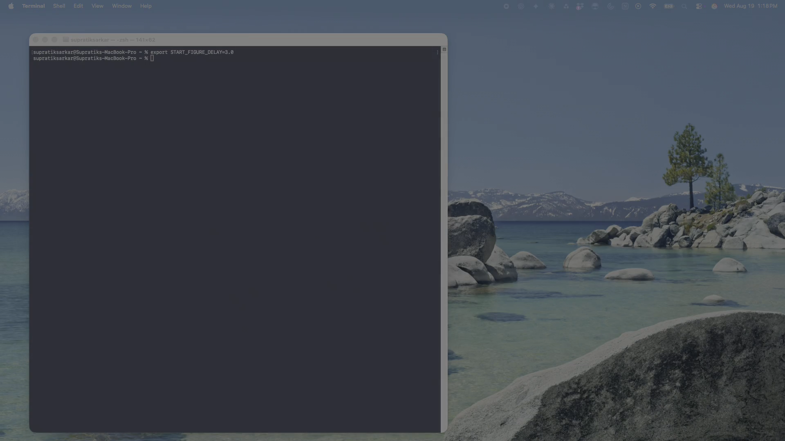

<div align="center">

# StART — Standardized Agentic Reusable Tests

**A model-review platform where deterministic engines compute, agents argue, evidence decides, and seals remember.**

[](https://github.com/supratik-sarkar/StART/actions)


<br/>

<a href="docs/media/start-demo.mp4">
  
</a>

<video src="docs/media/start-demo.mp4" poster="docs/media/start-demo-poster.png" controls="controls" width="100%" style="max-height: 640px; border-radius: 8px;" playsinline>
  <source src="docs/media/start-demo.mp4" type="video/mp4">
  Your browser does not support the video tag. <a href="docs/media/start-demo.mp4">Click here to watch the demonstration (start-demo.mp4)</a>.
</video>

<br/>
<sub><i>Click poster or player above to watch the full StART review demonstration (1080p).</i></sub>

</div>

---

## Quick start

```bash
git clone https://github.com/supratik-sarkar/StART.git
cd StART
python scripts/bootstrap.py
source .venv-start/bin/activate      # Windows: .venv-start\Scripts\Activate.ps1
start review
```

That's it. `bootstrap.py` verifies Python 3.12+, creates the environment, installs the
right dependency set, checks every import, and tells you what to run next. No choosing
between extras, no `requirements.txt` archaeology, no guessing which stack you need.

**No API key required.** StART runs fully offline and produces a complete, sealed review
using deterministic engines. LLM assistance is optional and additive — it narrates and
argues; it never computes a number.

<sup>Other profiles: `--profile minimal` (core only) · `--profile enterprise` (adds AI-engineering
adapters) · `--profile everything`. See what any of them would install with `--dry-run`.</sup>

---

## Table of contents

**Getting started** — [Quick start](#quick-start) · [Requirements](#requirements) · [Installation detail](#installation-detail) · [Verify your install](#verify-your-install)

**Concepts** — [The core idea](#the-core-idea) · [Why this design](#why-this-design) · [Architecture](#architecture) · [Risk stripes: beyond machine learning](#risk-stripes-beyond-machine-learning)

**Using it** — [The review](#the-review) · [The reviewer control surface](#the-reviewer-control-surface) · [Bring your own data](#bring-your-own-data) · [CLI reference](#cli-reference) · [Deep Learning Review Suite](#deep-learning-review-suite)

**Governance** — [Agentic governance: challenge & sign-off](#agentic-governance-challenge--sign-off) · [The attestation layer](#the-attestation-layer) · [Generated artifacts](#generated-artifacts)

**Deployment** — [Two environments, one repository](#two-environments-one-repository) · [LLM providers](#llm-providers) · [Adaptive compute routing](#adaptive-compute-routing) · [Databricks](#databricks) · [Safe degradation](#safe-degradation)

**Contributing** — [Repository layout](#repository-layout) · [Extending the registry](#extending-the-registry) · [Development workflow](#development-workflow) · [Troubleshooting](#troubleshooting)

**Project** — [Public-safety statement](#public-safety-statement) · [Roadmap](#roadmap) · [License](#license)

---

## The core idea

**Agents orchestrate. Deterministic engines compute. Evidence is the product.**

```
        ┌──────────────────────────────────────────────────┐
        │                  Agentic layer                   │
        │   12-agent review committee: plans, challenges,   │
        │   narrates — and never invents a number           │
        └──────────────────────┬───────────────────────────┘
                               │  plans / critiques / narrates
        ┌──────────────────────▼───────────────────────────┐
        │         Deterministic test registry              │
        │  preprocessing · supervised · xai · genai · dl    │
        └──────────────────────┬───────────────────────────┘
                               │  typed TestResult
        ┌──────────────────────▼───────────────────────────┐
        │  Evidence: content-addressed store + append-only  │
        │  SHA-256-chained ledger + Merkle review seal      │
        └──────────────────────────────────────────────────┘
```

Three claims, each of which is *tested* rather than asserted:

**The language model is not in the measurement chain.** Two runs of the same review, same
seed, produce different prose and byte-identical metrics. Verified: 23 metrics across 5
records agreed to 1e-9 while the narratives differed.

**Every figure in a narrative traces to evidence.** Numbers are extracted from generated
prose and bound to evidence records. An unbound figure blocks sealing. See
[narrative invariance](#1-narrative-invariance).

**One clone is safe in a public demo and inside a locked-down firm.** Not by convention —
by refusal at the routing boundary. See [Two environments](#two-environments-one-repository).

---

## Why this design

**Deterministic test registry.** Every quantitative check is a pure Python function
registered with `@register_test(...)`, with explicit parameters, seeds, thresholds and
declared limitations. Same data + same parameters + same policy ⇒ same numbers. CI verifies
determinism claims with property-based tests.

**Typed evidence.** Every test emits an `EvidenceRecord`: evidence/test/model/dataset/run
IDs, timestamp, parameters, metrics, thresholds, status, interpretation, limitations,
input-data hash, policy hash, git SHA, seed, device, package versions.

**Tamper-evident ledger.** Records are canonicalised, SHA-256 hashed, written to a
content-addressed store and appended to a hash-chained JSONL ledger
(`entry_hash_n = sha256(entry_hash_{n-1} + record_hash_n)`). Any retroactive edit breaks the
chain. `start attest replay` verifies it and *localises the break* — content tampering and
chain splicing are different findings.

**Proof-carrying narratives.** Quantitative claims carry inline citations like
`[EV-8535b74e2121]`. The EvidenceCriticAgent blocks narratives with uncited claims. In
deterministic mode narratives come from a template that is proof-carrying by construction,
so the guarantee holds with zero LLM access.

**Policy hashing.** Thresholds live in versioned YAML under `configs/policy/`. The file's
content hash is stamped into every evidence record, so a reviewer can prove which threshold
regime produced a verdict.

**Plugin architecture.** Register tests in-repo with `@register_test`, or ship them as pip
packages exposing a `start.test_packs` entry point. Risk stripes extend via
`start.risk_stripes`. Private inference gateways register via `start.llm_gateways` — no
core changes, no fork.

---

## Requirements

| | |
|---|---|
| **Python** | 3.12+ |
| **OS** | macOS (Apple Silicon and Intel), Linux, Windows |
| **GPU** | Optional. CUDA and Apple Silicon MPS used when present; CPU works everywhere |
| **Databricks / MLflow / LLM keys** | Optional. Everything degrades to local deterministic execution |

Core dependencies are deliberately light: numpy, pandas, scipy, scikit-learn, pydantic,
pyyaml, typer, rich. Heavy stacks live in extras — `dl`, `trees`, `tuning`, `xai`,
`formats`, `connectors`, `tracking`, `llm`, `llm-local`, `telemetry`, `observability`,
`mcp`, `redteam`, `evals`, `guardrails`, `orchestration`, `dev`, and `everything`.

`pyproject.toml` is the single source of dependency truth. `requirements.txt` is generated
from it and CI fails if they drift.

### A note on the src layout

The importable package lives at `src/start/`, not at the repository root. This prevents
importing the package from the working directory instead of the installed version — a
classic source of "works on my machine" — and avoids a name collision between the `start`
package and a venv directory. You never import from `src.start`; after installation you
simply `import start`.

---

## Installation detail

`python scripts/bootstrap.py` is the supported path and handles everything below. This
section is for people who want to know what it does or need to deviate.

**Profiles**

| Profile | Contents |
|---|---|
| `minimal` | Core engines, risk core, CLI |
| `demo` *(default)* | Modelling, explainability, OpenAI + Anthropic SDKs, test tooling |
| `enterprise` | The above plus OTel, Langfuse, LangSmith, Phoenix, MCP, DeepEval, NeMo Guardrails, LangGraph |
| `everything` | Every declared extra |

```bash
python scripts/bootstrap.py --dry-run                # exactly what would install, offline
python scripts/bootstrap.py --profile enterprise
python scripts/bootstrap.py --venv .venv-test --recreate   # disposable clean-room
```

**The classic setup trap.** A bare `python3` often resolves to system Python (3.9 on macOS),
silently creating the venv on the wrong interpreter. Bootstrap checks this and refuses. If
you build a venv by hand, use the full path: `/opt/homebrew/bin/python3.12`.

**Jupyter kernel** for the notebook demos:

```bash
python -m pip install ipykernel jupyterlab ipywidgets
python -m ipykernel install --user --name start --display-name "Python (StART)"
```

---

## Verify your install

```bash
start doctor              # device, providers, registry, egress profile
start doctor --adapters   # the AI-engineering control surface
start risk stripes        # the risk taxonomy this install supports
pytest                    # the full suite
```

`start doctor` reports the detected compute device, which LLM providers are reachable, the
registered test families and count, and — importantly — the active runtime profile and which
providers it permits.

---

## The review

`start review` is the main entry point. It is a conversation, not a batch job.

```bash
start review                                        # interactive wizard
start review --non-interactive                      # deterministic, no prompts
start review --provider openai --model gpt-4.1-mini # LLM-assisted committee
start review --data mydata.csv --target churned     # your own data
```

The wizard asks what you are reviewing, which dataset, which architecture, how to split, how
to handle each preprocessing decision, and which metric priority applies. Then the twelve-agent
committee runs:

| Agent | Role |
|---|---|
| DatasetDiscoveryAgent | Dataset understanding, profiling, leakage candidates |
| TaskInferenceAgent | Task framing and inference |
| FeatureEngineeringAgent | Data preparation, with the reviewer choosing each method |
| ArchitectureReviewAgent | Model selection and verification |
| HyperparameterTuningAgent | Optimisation strategy, leakage-safe by construction |
| ModelExecutionAgent | Training execution and telemetry |
| ExplainabilityAgent | Attributions, global and local |
| SensitivityAgent | Metric shock response |
| OverfittingAgent | Generalisation gap diagnosis |
| ValidationAgent | Adversarial and robustness checks |
| GovernanceSignoffAgent | MRM sign-off disposition |
| EvidenceCriticAgent | Evidence and citation integrity |

**Datasets.** Built-in synthetic AML/fraud generator (no download, controllable prevalence
and signal-to-noise), UCI Statlog German Credit (real credit risk, with a *published* 5:1 cost
matrix and protected attributes for fair-lending work), Fannie Mae loan performance
(bring-your-own file), or any local CSV/Parquet/TSV/JSON. Every pre-flight card states the
true source — a dataset is never presented as something it is not.

**Figures open as they are produced.** ROC, PR, calibration, confusion matrix and drift plots
open in your system viewer, labelled and paced, then land in `dashboard.html`. Use
`--no-open-figures` to suppress; suppressed automatically in CI and non-TTY runs.

---

## The reviewer control surface

Most validation tooling gives you a fixed pipeline and a yes/no. StART gives you the
methodological choice, the *computed consequence of every option*, and holds you to what you
chose.

```
FeatureEngineeringAgent recommends: winsorize outliers, IQR rule, multiplier 1.5
  reason: 3 numeric column(s) examined; worst: credit_amount (72 points)

      Method                     Affected    Retained   Rationale
  [1]*IQR x 1.5                171 (7.2%)      92.8%   Tukey default; robust to skew
  [2] IQR x 3.0                 44 (1.8%)      98.2%   far-outliers only; preserves tail risk
  [3] percentile 1/99           20 (2.0%)      98.0%   fixed proportion, distribution-agnostic
  [4] z-score |z| > 3           38 (1.6%)      98.4%   assumes approximate normality
  [5] none                       0 (0.0%)     100.0%   extremes may be real and material
  [6] custom                            —          —   specify rule and parameter

  [A] Accept  [1-6] Choose  [P] Plot distribution  [Q] Ask agent
```

Every count is computed by running the rule over your actual data before the prompt renders.
Nothing is illustrative. `[P]` opens the distribution with each candidate cut-point drawn on
it. A non-recommended choice requires a rationale, and that rationale is sealed.

The same pattern covers **missing values** (median/mode, indicator+impute, drop rows, drop
columns), **categorical encoding** (one-hot, ordinal, target/WoE with a leakage warning,
frequency, mixed — with a cardinality table), **scaling**, **class imbalance** (with an
explicit warning when weighting is already enabled, so you cannot double-correct by
accident), and **the decision threshold**.

The threshold matters more than it looks. Reporting metrics at a fixed 0.5 is not a decision
rule at low prevalence — it is an accident of the sigmoid. StART computes the F1-optimal,
F2-optimal, cost-optimal and alert-budget thresholds, shows the confusion matrix each would
produce, and records which one you chose.

---

## Agentic governance: challenge & sign-off

At every checkpoint you can **Accept**, **Override**, **Challenge**, or **Ask**. Challenge and
Ask route to the LLM with the evidence in hand; Override changes what actually executes.

```
 Accept (A) / Override (O) / Challenge (C) / [Q] ask ArchitectureReviewAgent? C
   Enter challenge: An LSTM assumes sequential dependency across timesteps. This is
   1000 rows of static credit records with no temporal ordering. Justify the recurrence.

   provider response ID: chatcmpl-EESrou5W...   latency 2.9s   313/120 tokens
   The use of an LSTM is not justified here... A multilayer perceptron or a
   gradient-boosted tree is a more defensible and appropriate choice for this
   binary classification task on tabular, static data.

 Accept (A) / Override (O) / Challenge (C)? O
   Override value: mlp
   Reviewer rationale: Agent conceded recurrence is unjustified for static tabular data.
```

**Concessions block sign-off.** When an agent's own response undermines its prior position,
that is recorded as a *conceded challenge* and it blocks — a review that can ignore its own
findings manufactures assurance rather than providing it.

**Well-reasoned overrides are not penalised.** An override made after an agent conceded, or
with a recorded rationale, is informational. An override with no rationale is a concern. The
distinction matters: counting every override as a concern teaches reviewers to stop
overriding.

**Benchmarking runs on every review.** Your model is compared against a majority-class
predictor, the base rate, and a **one-feature decision stump**. A model that cannot beat one
rule on one feature by a meaningful margin has unjustified complexity, and that is a finding
however good its AUC looks in isolation.

The MRM disposition weighs performance, generalisation, calibration, feature dependence,
fair-lending exposure, reviewer challenges and reviewer overrides, and returns **READY**,
**READY WITH CONDITIONS** or **NOT READY** with every factor tied to evidence.

---

## The attestation layer

Four mechanisms, each testing a claim that validation tooling routinely makes and rarely
substantiates. All standard-library only, so an archived review verifies years later on a
machine with nothing but Python.

### 1. Narrative invariance

*Claim tested: "the LLM only rephrases, it doesn't compute."*

The same section is produced twice — deterministically and through the model, from identical
evidence — then every quantitative claim in each is extracted and bound to evidence.

| Divergence | Meaning | Blocks |
|---|---|---|
| `unbound` | A figure appearing nowhere in the evidence. **Invented.** | yes |
| `contradiction` | A near-miss of a real figure. **Corrupted transcription.** | yes |
| `omission` | The deterministic path reported a figure the model dropped | no |
| `addition` | The model surfaced a real figure the deterministic path missed | no |

Honest rewording passes — including rendering `0.0707` as `7.07%`. A control that fires on
good writing gets switched off, so that case is tested explicitly.

### 2. Disclosure envelopes

*Claim tested: "we only send aggregates."*

Prompts are assembled from a **policy-derived projection** of the evidence, hashed and
recorded. Before egress, every numeric token in the outbound text must exist in the
projection or the call is refused. Policies narrow by trust domain — `public_demo`,
`restricted`, `minimal` — and tightening one requires no change to any agent or template.

The same policy governs the telemetry sink. Adding observability cannot quietly undo
containment.

### 3. Ledger replay

*Claim tested: "the results are reproducible."*

```bash
start attest replay start_output/ledger.jsonl
start attest replay original.jsonl --compare rerun.jsonl
```

Chain verification that localises the break and names its kind — `malformed`, `index`,
`content` (a record was edited), `linkage` (the chain was spliced) — plus cross-run metric
comparison with volatile fields excluded.

### 4. Review seals

*Claim tested: "this report is the one that was signed off."*

An ordered Merkle commitment over plan, policy, evidence head, attestations, containment
profile, environment, control coverage and **reviewer adjudications** — reducing a whole
review to one verifiable string:

```
start-seal/2:RUN-ENT-7f795947:dd1130cde92b7a7c0ee2bee49b4b953a
```

```bash
start attest trace <seal>                                  # seal → evidence records
start attest verify-seal manifest.json --seal <seal>       # recompute and localise
```

A Merkle tree rather than a flat hash for one reason: a flat hash says only "something
changed". In a dispute, *the evidence was altered* and *the plan hash does not match, the
evidence is intact* are entirely different arguments.

**StART refuses to emit a seal over an empty or unlinked evidence chain.** A seal that
commits to nothing verifies forever and attests to nothing — worse than no seal, because it
does not announce itself.

---

## Risk stripes: beyond machine learning

A model inventory is not a folder of pickles. It is mostly deterministic calculators,
spreadsheets, rules engines, vendor black boxes and expert-judgment overlays. Machine
learning is the minority.

StART reviews a **risk object** across three orthogonal axes:

| Axis | Question | Module |
|---|---|---|
| **Stripe** | What risk is being borne? | `start.risk.stripes` |
| **Object** | What artefact bears it? | `start.risk.objects` |
| **Dimension** | What must a reviewer establish? | `start.risk.dimensions` |

15 stripes — credit, market, liquidity, capital & stress, valuation, operational, financial
crime, fraud, conduct, climate, treasury/IRRBB, model, technology & cyber, third party,
AI/GenAI. 13 object kinds. 22 dimensions.

**Burden conservation** is the mechanism that makes it work. When a dimension cannot apply,
its obligation does not evaporate — it transfers, and the inheriting dimensions become
mandatory:

```bash
start risk plan --stripe financial_crime --kind vendor_model --materiality high
```
```
Substituted — the obligation transfers rather than lapsing:
  discriminatory_power   → benchmarking, implementation_verification
  accuracy_calibration   → benchmarking, outcomes_analysis
  explainability         → third_party_diligence, sensitivity

plan hash  6376aadade7da72cc01fd223919d2c4b1a6a7ce0...
```

Plans are deterministic and carry a content hash. Recompute at sign-off: if it differs, the
scope moved after it was agreed.

Stripes map to published frameworks — SR 11-7 / OCC 2011-12, BCBS 239, FRTB, IFRS 9 / CECL,
ECOA / Reg B, EU AI Act, NIST AI RMF, ISO/IEC 42001, Interagency TPRM — with
`start risk coverage` computing which expectations the examined dimensions discharge.

> These mappings are interpretations, not legal advice or compliance certification. Coverage
> means a dimension was examined and produced evidence; it says nothing about whether that
> evidence was adequate. Frameworks referenced but not yet mapped are reported as **unmapped**
> rather than silently counted as covered.

---

## Two environments, one repository

This repository is public and demonstrates against OpenAI, Anthropic and DeepSeek. The same
code must run inside an organisation that mandates an internal gateway, where reaching a
public endpoint is a serious incident.

The usual answer is a config flag. That fails silently — one forgotten key in a shell profile
is enough. StART's answer is a **runtime profile** checked as a precondition:

```
public_demo   third-party SaaS inference permitted — the point of the demo
enterprise    only the operator-supplied gateway; public providers REFUSED
airgapped     no outbound inference at all
```

```console
$ START_PROFILE=enterprise start review --provider openai
ProfileViolation: Provider 'openai' reaches a third-party inference endpoint, which
the 'enterprise' runtime profile does not permit. Use the operator-supplied gateway:
    export START_GATEWAY_BASE_URL=<your gateway base URL>
    export START_GATEWAY_API_KEY_ENV=<name of the env var holding the token>
```

The refusal holds regardless of installed SDKs or exported credentials. Installing the
`openai` client library is *not* a statement about which endpoints may be reached — that same
library is the standard transport for an OpenAI-compatible internal gateway.

**Pointing at an internal gateway.** If it speaks OpenAI chat-completions, three environment
variables and no code changes. If it does not, ship a private wheel declaring a
`start.llm_gateways` entry point — StART discovers it, and **you never edit a file in this
repository**, so upstream pulls never conflict. Details in
[docs/enterprise_integration.md](docs/enterprise_integration.md).

Note the credential indirection: StART is told *which environment variable holds the token*,
never the token and never a fixed variable name. Your credential naming convention is an
internal detail and stays out of this repository.

---

## LLM providers

| Provider | Env var | Notes |
|---|---|---|
| OpenAI | `OPENAI_API_KEY` | |
| Anthropic | `ANTHROPIC_API_KEY` | |
| DeepSeek | `DEEPSEEK_API_KEY` | |
| Gemini | `GEMINI_API_KEY` | |
| Grok | `GROK_API_KEY` | |
| Hugging Face | `HF_TOKEN` | hosted or local |
| Gateway | `START_GATEWAY_BASE_URL` | any OpenAI-compatible endpoint |

Keys are read from the environment only — never prompted for in a way that echoes, never
written to disk by StART, never committed. `.env.example` ships with blank placeholders; `.env`
is gitignored.

For a durable personal store that survives version upgrades, keep keys in
`~/.config/start/credentials.env` (mode 600) and source it. StART's precedence is process
environment → repo `.env` → user config, and it never overwrites an already-set variable —
which is what makes the same file safe inside a managed environment.

---

## Dual-mode agent review: deterministic vs LLM-assisted

| | Deterministic | LLM-assisted |
|---|---|---|
| Metric computation | Registered engines | Registered engines *(identical)* |
| Narrative | Proof-carrying template | Model, bound to evidence |
| Challenge responses | Rule-based | Model, with response ID and token counts recorded |
| Requires a key | No | Yes |
| Reproducible metrics | Yes | Yes — verified across runs |

The LLM path is additive. Turn it off and you lose prose quality and the ability to argue with
an agent; you lose no numbers, no evidence, no seal.

---

## Bring your own data

```bash
start review --data data/train.csv --target churned --test data/holdout.csv
```

CSV, Parquet, TSV and JSON are supported. `--test` is optional but required for drift,
split-diagnostics and supervised tests. If your file lacks a score column, supervised and XAI
tests are **skipped explicitly** — visible in the output and in evidence — rather than failing.

Or pass a fitted model through the Python API:

```python
from start import build_context, load_config, run_review

config = load_config("configs/default.yaml")
result = run_review(config, build_context(config, train_df, test_df, model=fitted_model))
```

### Config-driven runs

```bash
start init                                    # scaffold configs/ and start_output/
start plan   --config configs/default.yaml    # preview what would run; writes nothing
start run    --config configs/default.yaml data/train.csv --test data/holdout.csv
start report --config configs/default.yaml    # re-print the latest report
```

```yaml
model:
  model_id: churn-propensity-v3
  task_type: binary_classification
  materiality: high
  target_column: churned
  score_column: churn_score

test_families:
  enabled: [preprocessing, supervised, xai]
  overrides:
    preprocessing.missingness: { warn_pct: 2.0, fail_pct: 10.0 }
    supervised.discrimination: { auc_warn: 0.70, auc_fail: 0.60 }
```

For governed regimes put thresholds in the **policy YAML** instead — its content hash is
stamped into every record, so a reviewer can prove which regime produced a verdict.

---

## CLI reference

```bash
# environment and containment
start doctor                    start doctor --adapters
start attest egress             # profile, permitted and refused providers

# the risk core (works with zero dependencies installed)
start risk stripes              start risk objects        start risk dimensions
start risk plan --stripe market --kind deterministic_calculator --materiality high
start risk coverage --stripe credit --examined discriminatory_power,outcomes_analysis

# attestation
start attest replay start_output/ledger.jsonl
start attest trace <seal-string>
start attest verify-seal manifest.json --seal <seal-string>

# review
start list-tests                start review              start report
```

Without Typer installed, the risk core is still reachable: `python -m start.risk plan --stripe fraud --kind rules_engine`.

---

## Architecture

```
start/
├── risk/              stripes, objects, dimensions, plan synthesis   [stdlib only]
├── attestation/       claims, invariance, disclosure, replay, seals  [stdlib only]
├── governance/        findings, MRM sign-off, challenge disposition
├── runtime_profile    containment regime and egress policy           [stdlib only]
├── registry/          deterministic test registry
├── tests/             the engines (preprocessing, supervised, xai, dl, genai)
├── modeling/          data, training, tuning, method options, benchmarking, XAI
├── agents/            the review committee
├── evidence/          hash-chained ledger + content-addressed store
├── providers/         compute, data, experiment, LLM, gateway
├── ai_engineering/    OTel, Langfuse, LangSmith, Phoenix, MCP, Garak, DeepEval, …
├── reporting/         figures, dashboards, transcripts, artifacts
└── cli/               command line, theme, panels
```

The stdlib-only boundary is load-bearing. The first questions StART answers in a constrained
environment are *what egress am I under* and *what does this review owe* — neither may depend
on whether numpy imported cleanly. CI enforces it with a job that runs the risk and
attestation core with nothing installed at all.

---

## Deep Learning Review Suite

```bash
start review --run-dl                                    # tabular MLP, deterministic
start review --run-dl --architecture wide_deep --explain gradient_shap
start review --run-dl --data mydata.csv --target y
start review --run-dl --provider openai                  # LLM-assisted governance
```

Implemented behind the `dl` extra: tabular MLP, Leaky-ReLU MLP, Residual MLP, Wide & Deep,
with Integrated Gradients / Gradient SHAP / permutation explainability and shock, noise and
masking robustness. Compute routes automatically across CUDA → MPS → CPU.

Sequence architectures (RNN, LSTM, GRU, TCN, Transformer, TFT) are selectable, and the
committee will tell you when they are inappropriate for your data — on static tabular records
an LSTM has no sequence to model, and ArchitectureReviewAgent says so under challenge.

---

## Self-healing committee

The orchestrator runs agents through an asynchronous telemetry bus with checkpointing and
recovery. When a stage fails, the interceptor classifies the failure, attempts a bounded
remediation, and records both the failure and the remedy as evidence rather than swallowing
them.

- **Topology** — a directed review graph with explicit stage dependencies, rendered to
  `review_graph.png` on every run
- **Telemetry** — non-blocking event bus; a slow or failing sink never stalls a review
- **Self-healing** — bounded retry with cause classification; unrecoverable failures surface
  as findings, never as silence

---

## Adaptive compute routing

StART detects and routes across **CUDA → MPS → CPU** automatically, and reports the selected
device in `start doctor` and in every evidence record's reproducibility block. Nothing is
required from you; nothing breaks if only CPU is available. Batch sizes and tuning budgets
stay laptop-safe by default.

---

## Databricks

The notebooks under `notebooks/` run unchanged on Databricks. MLflow logging activates when
available and is skipped explicitly when not. Delta and Snowflake connectors ship behind the
`connectors` extra. The enterprise gateway placeholder is the supported path for firm-internal
inference.

---

## Generated artifacts

Every run writes to `start_output/`:

```
start_output/
├── ledger.jsonl              hash-chained evidence ledger
├── evidence_store/           content-addressed records
├── seals/<run>/              seal manifest — recompute with attest verify-seal
├── model_execution/<run>/    split distribution, metrics by split, confusion matrix,
│                             training history, global feature importance
├── figures/<run>/            ROC, PR, calibration, confusion matrix, drift (PNG)
├── tuning/<run>/             trials, folds, summary
├── ai_engineering/<run>/     policy, MCP, telemetry, red-team, guardrail, eval reports
├── dashboards/<run>/         dashboard.html / .md / .json
├── transcripts/<run>/        the full reviewer session, including every challenge
└── reports/<run>.md          the review report
```

---

## Safe degradation

Nothing is a hard dependency except the core. Missing torch skips the DL suite *explicitly*.
Missing shap skips SHAP tests *explicitly*. No API key means deterministic narratives. No
GPU means CPU. No MLflow means local artifacts. Every skip is visible in the output table and
recorded in evidence — StART never silently omits work and reports success.

---

## Extending the registry

```python
from start.registry import register_test, TestContext
from start.core.schemas import TestResult, Status

@register_test(
    test_id="custom.my_check",
    family="preprocessing",
    name="My check",
    description="What it establishes",
)
def my_check(ctx: TestContext, warn_pct: float = 5.0) -> TestResult:
    pct = float(ctx.train.isna().mean().max() * 100)
    return TestResult(
        status=Status.WARN if pct > warn_pct else Status.PASS,
        metrics={"max_missing_pct": pct},
        thresholds=[{"metric": "max_missing_pct", "warn": warn_pct}],
        interpretation=f"Highest column missingness is {pct:.2f}%.",
        limitations=["Column-wise only; does not detect structured missingness."],
    )
```

Ship it as a package exposing `start.test_packs` and it is discovered without touching core.

---

## Repository layout

```
StART/
├── src/start/            the package (see Architecture)
├── tests/                the suite
├── scripts/              bootstrap.py, demo_flight.py, record_demo.sh, sync_requirements.py
├── configs/              default config and versioned policy YAML
├── notebooks/            Databricks and Jupyter demos
├── examples/             standalone scripts
├── docs/                 architecture, enterprise integration, changelog
├── pyproject.toml        authoritative dependency metadata
└── requirements.txt      GENERATED from pyproject — do not edit
```

---

## Development workflow

```bash
python scripts/bootstrap.py --profile enterprise --recreate
source .venv-start/bin/activate

ruff check src tests scripts
mypy
pytest
python -m pip check
python -m compileall -q src scripts
python scripts/sync_requirements.py --check    # after any pyproject change
```

Validate the installer against a **disposable** environment, never a working one — a
long-lived venv carries packages installed by hand months ago and proves nothing:

```bash
python scripts/bootstrap.py --venv .venv-bootstrap-test --profile everything --recreate
```

CI reproduces Linux and macOS on Python 3.12 and 3.13, runs a job with *nothing* installed to
enforce the stdlib-only boundary, and pins `START_PROFILE=airgapped` so no test can reach a
public endpoint even if a credential is present.

---

## Troubleshooting

**`start: command not found`** — the venv is not active, or the package is not installed into
this interpreter. Check `which python` points inside `.venv-start`, then
`pip install -e ".[dev]"`.

**Wrong Python version** — the venv was created on the system interpreter. Delete it and
re-run `python scripts/bootstrap.py --recreate`.

**Far fewer tests than expected** — the DL suite was skipped because torch is not installed.
Use `--profile demo` or higher.

**No colour in the terminal** — you piped the output. Rich strips ANSI when stdout is not a
TTY. Set `FORCE_COLOR=1` if you need colour through a pipe.

**Figures do not open** — expected in CI, non-TTY and headless environments; StART says so
explicitly and still writes them to `start_output/figures/`.

**Provider refused under `enterprise`** — that is the containment working. Set
`START_PROFILE=public_demo` if this really is a demo machine.

---

## Public-safety statement

This repository is a clean-room public implementation. It contains **no** proprietary code,
internal endpoints, credentials, firm-specific templates, policies, thresholds or schemas. The
enterprise gateway and warehouse connectors are intentionally empty interfaces for private,
out-of-repo implementations. Keep real policies in private configuration; never commit `.env`.

---

## Roadmap

- **The five attestation mechanisms** — claim graph with typed cross-agent contradiction
  detection, proof-obligation graph (governance as a type system), precision budget
  (false-precision detection against run-to-run variance), counterfactual sign-off (the
  minimal evidence change that would flip the decision), and evidence half-life
- **Quantitative-finance DL tracks** by dataset type: limit order books, tick events,
  multi-asset panels, volatility surfaces, alternative text data — the type-aware
  recommendation maps already ship in `start.taxonomy`
- **Sequence models** demonstrated on genuinely sequential data with DeepLIFT and occlusion
  analysis
- **Test families**: unsupervised, recommender ranking, portfolio optimisation diagnostics,
  performance attribution, embedding drift
- **GenAI**: NLI-based grounding, prompt-injection probes, retrieval faithfulness
- Ray/Dask distributed backends; Spark-native engines for large cohorts
- Signed report bundles; PDF rendering

---

## Contributing

Extend without forking: `start.test_packs` for engines, `start.risk_stripes` for
organisation-specific stripes, `start.llm_gateways` for a private inference gateway.

Never commit credentials, `.env`, virtual environments, generated outputs, caches, build
artefacts, or any organisation identifier. CI fails on all of them.

## License

Apache-2.0. See [LICENSE](LICENSE). Prior documentation for the v2.x line is preserved in
[docs/archive/](docs/archive/).
