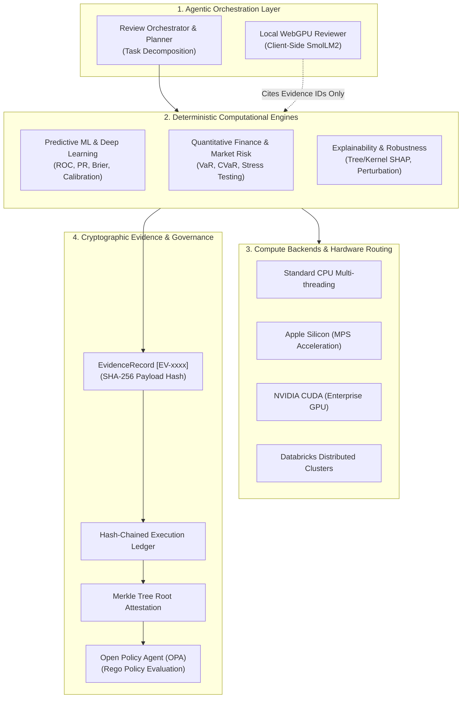

# StART: Standardized Agentic Reusable Tests

[](LICENSE)
[](pyproject.toml)
[](pyproject.toml)
[](#architectural-invariant)
[](#hardware-routing--compute-tiers)
[](https://x.com/SupratikSarkar_)

> **Evidence-native model development, independent review, risk governance, and quantitative validation platform combining autonomous agent orchestration with deterministic computational engines.**

---

## Origin & Engineering Lineage

* **Classification**: `INDEPENDENT ENGINEERING / SYSTEMS PLATFORM` (Not an academic research project).
* **Development Chronology**: StART was conceived and built independently by Supratik Sarkar as an exploratory systems engineering project to demonstrate that AI agents could orchestrate rigorous software and mathematical diagnostics without hallucinating calculations. Open-source contributors subsequently joined to expand its financial and machine-learning diagnostics. Following formal internal technical compliance and architecture reviews, the platform was adapted and imported into enterprise environments for model validation workflows. It represents practical, production-grade systems engineering.

---

## Architectural Invariant

Unlike conventional LLM-based assistants that perform hallucination-prone arithmetic, StART enforces a fundamental structural boundary:

$$\mathbf{\text{AI Agents Reason and Orchestrate}} \quad\Longleftrightarrow\quad \mathbf{\text{Deterministic Engines Compute}}$$

1. **Reasoning & Planning**: Large language models decompose high-level review mandates, select diagnostic methodologies, interpret statistical findings, and synthesize narrative summaries.
2. **Deterministic Computation**: All mathematical operations, loss evaluations, statistical tests, Value-at-Risk (VaR) estimations, and SHAP calculations are executed strictly by compiled, verified numerical engines (NumPy, SciPy, PyTorch, scikit-learn).
3. **Cryptographic Proof Chain**: Every diagnostic step produces an immutable `EvidenceRecord` carrying a unique identifier (`[EV-xxxx]`), inputs/outputs, parameter configurations, and a cryptographic SHA-256 hash. Records are appended to a hash-chained execution ledger sealed into a root Merkle attestation.

```
+-------------------------------------------------------------------------------------------------+
|                                    StART PLATFORM ARCHITECTURE                                  |
|                                                                                                 |
|   [ Agent Orchestration ]         [ Deterministic Engines ]         [ Evidence & Governance ]   |
|   • Review Task Planner           • Predictive ML & Deep Learning   • Hash-Chained Ledger       |
|   • Finding Synthesizer    --->   • Quantitative Finance & VaR ---> • Merkle Tree Sealing       |
|   • WebGPU Local Reviewer         • SHAP & Permutation Feature Imp  • OPA Rego Policy Evaluation|
|                                   • Numerical Calibration / Drift   • Audit Verification Report |
+-------------------------------------------------------------------------------------------------+
```



---

## Core Implemented Capabilities

| Subsystem | Implemented Functionality | Primary Engine Reference |
| :--- | :--- | :--- |
| **Predictive ML Diagnostics** | Comprehensive model evaluation: ROC-AUC, PR curves, expected calibration error (ECE), Brier score, and threshold tuning | `start.engines.predictive` |
| **Deep Learning Verification** | Gradient health tracking, weight norm stability, activation drift, and loss divergence detection | `start.engines.deeplearning` |
| **Quantitative Finance** | Value-at-Risk (Historical, Parametric, Monte Carlo), Expected Shortfall (CVaR), volatility surfaces, and backtesting | `start.engines.market` |
| **Model Explainability** | Exact tree and kernel SHAP attributions, permutation importance, and feature dependence surfaces | `start.engines.explainability` |
| **Cryptographic Ledger** | Immutable append-only audit trail linking every numerical result to source parameters and git commit state | `start.core.evidence` |
| **Policy Enforcement** | Native Open Policy Agent (OPA) Rego evaluation against institutional governance standards | `start.governance.opa` |
| **Hardware Abstraction** | Dynamic compute dispatch targeting local CPU, Apple Silicon Metal (MPS), NVIDIA CUDA, or Databricks | `start.compute.router` |
| **Institutional Workstation** | FastAPI backend paired with interactive React Flow DAG execution inspector and WebGPU local LLM assistance | `start.web` |

---

## Hardware Routing & Compute Tiers

StART provides a unified execution router that automatically detects available accelerators and dispatches numerical workloads accordingly:

* **CPU**: Vectorized NumPy/SciPy execution with configurable OpenMP thread pools.
* **Apple Silicon (MPS)**: PyTorch MPS acceleration on macOS workstations for deep learning and matrix decompositions.
* **NVIDIA CUDA**: Multi-GPU acceleration for intensive training audits and Monte Carlo market path simulations.
* **Databricks Integration**: Cluster deployment hooks for large-scale distributed parquet data ingestion and model scoring.

---

## Quick Start & Workstation

### 1. Installation
Requires Python 3.12:
```bash
# Clone repository
git clone https://github.com/supratik-sarkar/StART.git
cd StART

# Create and activate Python 3.12 environment
python3.12 -m venv .venv-start
source .venv-start/bin/activate

# Install core package with CLI utilities
pip install -e .

# Verify environment and accelerator detection
start doctor
```

### 2. Command-Line Execution
Run deterministic model reviews across supported domains:
```bash
# Execute predictive ML evaluation
start review --domain predictive --mode deterministic

# Execute market risk & portfolio quantitative diagnostics
start review --domain market --mode deterministic
```

### 3. Launching the Interactive Workstation
```bash
# Launch the FastAPI evidence server
start web --port 8000

# Access http://localhost:8000 to view execution DAGs and interactive evidence trees
```

---

## Repository Structure

```text
StART/
├── configs/            # Pre-configured review templates (Credit, Market, Fraud, NLP)
├── deploy/             # Containerization, Helm charts, and Databricks cluster specs
├── docs/               # Architecture design notes, compliance runbooks, and API specs
├── examples/           # Standalone demonstration scripts across predictive & market domains
├── src/
│   └── start/
│       ├── cli/            # Command-line interface definitions and commands
│       ├── compute/        # Hardware routing (CPU, MPS, CUDA, Databricks)
│       ├── core/           # EvidenceRecord, hash chaining, and Merkle tree engine
│       ├── engines/        # Deterministic math engines (predictive, market, explain)
│       ├── governance/     # Open Policy Agent (OPA) Rego compliance gatekeepers
│       ├── orchestrator/   # Agentic review workflows and task planners
│       └── web/            # Institutional workstation backend (FastAPI, WebSockets)
├── tests/              # Extensive unit, regression, and hardware-conformance test suite
├── webapp/             # Modern frontend interface for interactive DAG visualization
├── pyproject.toml      # Build metadata (name: start-mrt v5.1.3)
└── LICENSE             # Apache License 2.0
```

---

## Portfolio Navigation

Part of the **Engineering & Systems Portfolio** by [Supratik Sarkar](https://github.com/supratik-sarkar):
* [StART](https://github.com/supratik-sarkar/StART) — Evidence-native model development and institutional review platform.
* [agentic-ai-systems](https://github.com/supratik-sarkar/agentic-ai-systems) — Resilient agent runtimes, checkpointing, and protocol gateways.
* [multimodal-context-systems](https://github.com/supratik-sarkar/multimodal-context-systems) — Context assembly, graph retrieval, and multimodal grounding.
* [training-inference-systems](https://github.com/supratik-sarkar/training-inference-systems) — Accelerated training primitives and hardware-conscious inference.
* [applied-ml-systems](https://github.com/supratik-sarkar/applied-ml-systems) — Anomaly detection, optimization, and recommendation engines.
