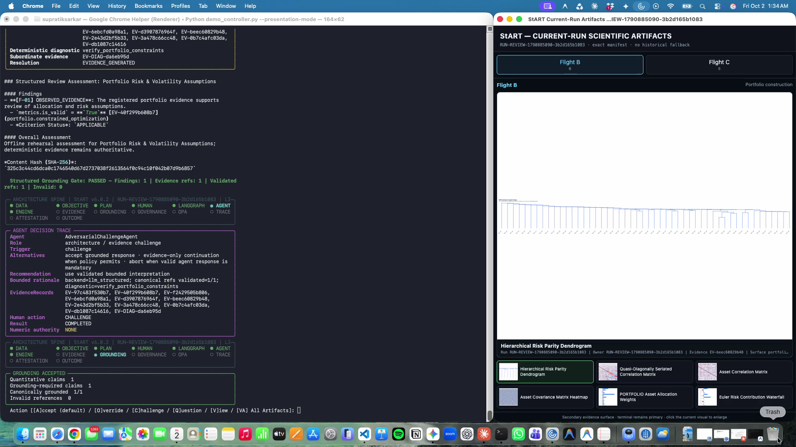
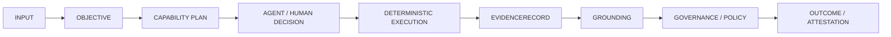
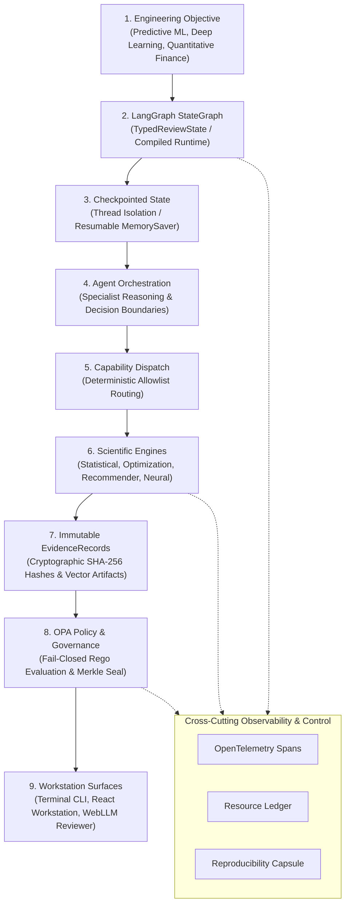

# StART — Standardized Agentic Reusable Tests

### Evidence-Native Model Development and Review

[](https://github.com/supratik-sarkar/StART/releases/tag/v6.0.2)
[](LICENSE)
[](pyproject.toml)
[](https://github.com/supratik-sarkar/StART/actions/workflows/core-ci.yml)
[](webapp/)
[](#architectural-invariant--orchestration)
[](src/start/certification/policies.py)
[](src/start/telemetry/engineering_trace.py)
[](https://x.com/SupratikSarkar_)

**LangGraph orchestrates. Agents reason. Deterministic engines calculate. EvidenceRecords prove. OPA governs. OpenTelemetry observes.**

---

## Demonstration

[](#demonstration)

*Interactive dual-pane demonstration featuring live terminal observability, real-time deterministic calculations, and dynamic artifact board.*

[Explore the Web Workbench →](#web-workbench)

---

StART is an evidence-native development and review workbench in which agents contribute reasoning while deterministic engines retain quantitative authority. Evidence, human challenge, grounding, governance, policy, and attestation remain inspectable throughout the run.

---

## Generalized Review Workflow


```mermaid
flowchart LR
    In["INPUT"] --> Obj["OBJECTIVE"]
    Obj --> Plan["CAPABILITY PLAN"]
    Plan --> Dec["AGENT / HUMAN DECISION"]
    Dec --> Exec["DETERMINISTIC EXECUTION"]
    Exec --> Ev["EVIDENCERECORD"]
    Ev --> Ground["GROUNDING"]
    Ground --> Gov["GOVERNANCE / POLICY"]
    Gov --> Out["OUTCOME / ATTESTATION"]
```

---

## Architectural Invariant & Orchestration

Unlike conversational LLM tools where arithmetic and statistical outputs risk model hallucination, StART establishes an unyielding boundary: **AI agents reason and propose, while deterministic mathematical engines perform all computations**.


```mermaid
flowchart TD
    Obj["1. Engineering Objective\n(Predictive ML, Deep Learning, Quantitative Finance)"] --> LG["2. LangGraph StateGraph\n(TypedReviewState / Compiled Runtime)"]
    LG --> State["3. Checkpointed State\n(Thread Isolation / Resumable MemorySaver)"]
    State --> Orch["4. Agent Orchestration\n(Specialist Reasoning & Decision Boundaries)"]
    Orch --> Dispatch["5. Capability Dispatch\n(Deterministic Allowlist Routing)"]
    Dispatch --> Engines["6. Scientific Engines\n(Statistical, Optimization, Recommender, Neural)"]
    Engines --> EvRec["7. Immutable EvidenceRecords\n(Cryptographic SHA-256 Hashes & Vector Artifacts)"]
    EvRec --> Gov["8. OPA Policy & Governance\n(Fail-Closed Rego Evaluation & Merkle Seal)"]
    Gov --> Surfaces["9. Workstation Surfaces\n(Terminal CLI, React Workstation, WebLLM Reviewer)"]

    subgraph Observability ["Cross-Cutting Observability & Control"]
        OTel["OpenTelemetry Spans"]
        Ledger["Resource Ledger"]
        Capsule["Reproducibility Capsule"]
    end
    LG -.-> Observability
    Engines -.-> Observability
    Gov -.-> Observability
```

---

## Key Product Capabilities

* **Numerical Authority & Zero Hallucination**: Deterministic calculation engines establish quantitative truth. Language models are structurally barred from generating numbers or claiming mathematical authority.
* **Cryptographic EvidenceRecords**: Every diagnostic metric, table, and figure is sealed into an immutable `EvidenceRecord` containing SHA-256 fingerprints, execution node lineage, and verification criteria.
* **Separation of Grounding, Governance, and Policy**:
  - **Grounding** verifies whether natural language claims match recorded evidence metrics.
  - **Governance** tracks institutional dispositions (`ACCEPT`, `ACCEPT_WITH_CONDITIONS`, `CHALLENGED_PENDING_REVIEW`).
  - **OPA Policy** evaluates fail-closed machine rules (`ALLOW` / `DENY`). A policy `ALLOW` is never conflated with model approval.
* **Human Challenge & Lineage**: Reviewers can challenge findings and record structured decisions. Challenges append immutable decision receipts, update governance state, and branch into traceable child reviews without mutating historical runs.
* **Cryptographic Attestation**: The append-only evidence ledger resolves to a Merkle tree root hash signed upon run finalization, guaranteeing end-to-end auditability.
* **Multi-Domain Scientific Coverage**:
  - **Predictive ML**: Data integrity, feature drift (PSI), ROC/AUC discrimination, Brier score calibration, and perturbation robustness.
  - **Deep Learning**: Temporal sequence classification, architecture diagnostics, training dynamics, and temporal input-gradient saliency.
  - **Quantitative Finance**: Traded risk, portfolio construction (HRP, MVO), covariance matrix conditioning, VaR exception backtesting (Kupiec, Christoffersen), and reverse stress testing.
  - **Recommender Systems**: Ranking evaluation (NDCG@K), interaction sparsity, and coverage metrics.

---

## Quick Start

StART v6.0.2 is distributed from source.

### 1. Installation

```bash
# Clone the repository
git clone https://github.com/supratik-sarkar/StART.git
cd StART

# Create and activate a clean virtual environment
python3 -m venv .venv
source .venv/bin/activate

# Upgrade pip and install StART from source
python -m pip install --upgrade pip
pip install .

# Verify CLI installation
start --version
start --help
start review --help
```

> **Note**: v6.0.2 is installed from source. Package-registry distribution is intentionally deferred. Release verification was performed with Python 3.12.13 on macOS and Linux (Ubuntu 22.04 / 24.04).

### 2. Deterministic CLI Reviews

```bash
# Run deterministic predictive ML review
start review --domain predictive --mode deterministic

# Run quantitative finance risk and portfolio review
start review --domain market --mode deterministic

# Check environment diagnostics and provider connectivity
start doctor
```

---

## Web Workbench

StART includes a local browser-based engineering workbench (`webapp/`) with an offline demonstration twin requiring zero hosted model calls.

```bash
cd webapp
npm install
npm run dev
```

Open `http://localhost:5173` to access:

* **Task Composer & Dataset Hub**: Select workflows, inspect exploratory data profiles, select execution modes (Hybrid Workbench, Agentic Session, Deterministic Run), and review planned execution milestones before execution.
* **Live Execution & Analytical Output**: Stream runtime events, inspect deterministic milestones, and examine generated SVG charts and data tables.
* **Outcome Capsule**: Review the 13-point structured completion summary: Started with, Objective, Alternatives, Human decisions, Agent contribution, Deterministic execution, Evidence status breakdown, Grounding, Governance disposition, Policy result, Achieved result, Remaining conditions, and Merkle Attestation.
* **Evidence Ledger & Failure Inspection**: Inspect full EvidenceRecords with canonical IDs, exact numerical metrics, and failure criteria. Failed records remain visibly and textually `FAIL`.
* **Human Review & Challenge**: Record structured review actions (`ACCEPT`, `CHALLENGE`, `OVERRIDE`, `ESCALATE`) with rationales and persisted receipts.
* **Run History & Comparison**: Compare distinct reviews with backend-supplied metric deltas. Same-run comparison is strictly prevented.
* **Scientific Certification**: Inspect the independent scientific assurance matrix across verified capability dimensions.

---

## Platform Support

| Operating System | Support Level | Verification Scope |
| :--- | :---: | :--- |
| **macOS (Apple Silicon & Intel)** | Directly Verified | Core engines, CLI, visible Terminal presentation mode, artifact board, and web workbench. |
| **Linux (Ubuntu 22.04 / 24.04)** | CI-Verified | Source installation, CLI smoke, packaging contract, hermetic test suites, and frontend build. |
| **Windows** | Uncertified | Not formally certified for this release. Source installation may operate under WSL2. |

---

## Repository Structure

```text
StART/
├── .github/workflows/       # GitHub Actions CI (core-ci, packaging, frontend)
├── configs/                 # Policy, runtime, and model configurations
├── data/                    # Benchmark datasets and scientific certification bundle
├── deploy/                  # Container, cloud, and edge deployment configurations
├── docs/                    # Architecture contracts, specifications, and runbooks
├── examples/                # Quickstart and integration examples
├── notebooks/               # Interactive exploration and review workflows
├── scripts/                 # Verification, bootstrap, and demonstration drivers
├── src/start/               # Core scientific engines, agents, runtime, and web services
├── tests/                   # Automated regression, invariant, and contract test suites
└── webapp/                  # React 18 / TypeScript evidence-native workstation
```

---

## Portfolio Navigation

Part of the Engineering & Systems Portfolio by [Supratik Sarkar](https://github.com/supratik-sarkar):

- [training-inference-systems](https://github.com/supratik-sarkar/training-inference-systems) — Distributed training, inference optimization, and systems performance.
- [agentic-ai-systems](https://github.com/supratik-sarkar/agentic-ai-systems) — Multi-agent orchestration, tool routing, and autonomous evaluation systems.
- [multimodal-context-systems](https://github.com/supratik-sarkar/multimodal-context-systems) — Long-context retrieval, multimodal embeddings, and grounding engines.
- [applied-ml-systems](https://github.com/supratik-sarkar/applied-ml-systems) — Production ML pipelines, monitoring, and robust predictive modeling.
- **StART** (Current) — Evidence-native model development and institutional review workbench.

---

## License

[Apache-2.0](LICENSE). Copyright (c) 2026 StART contributors.
